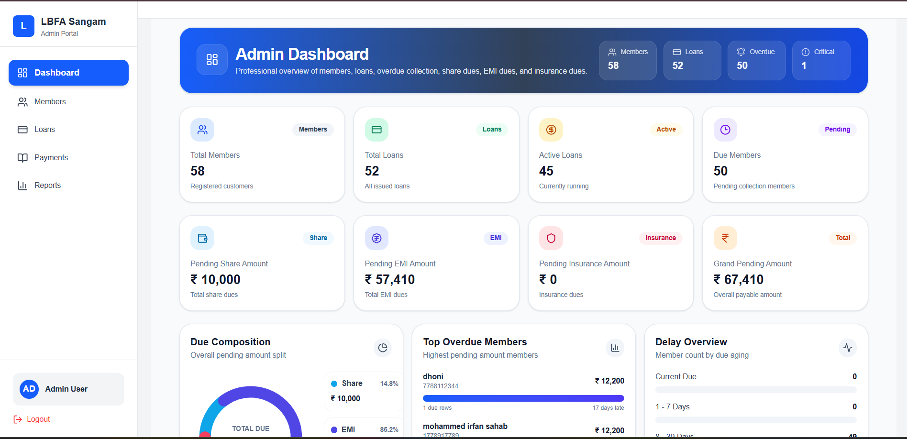
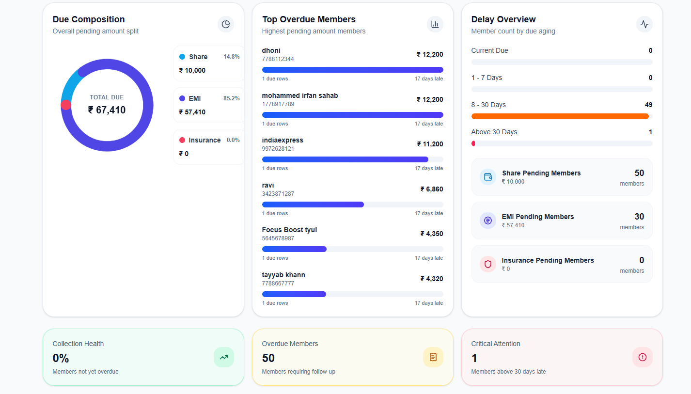
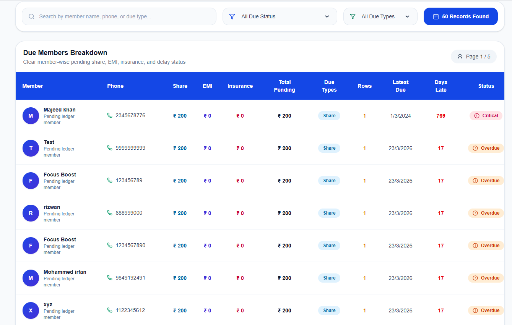
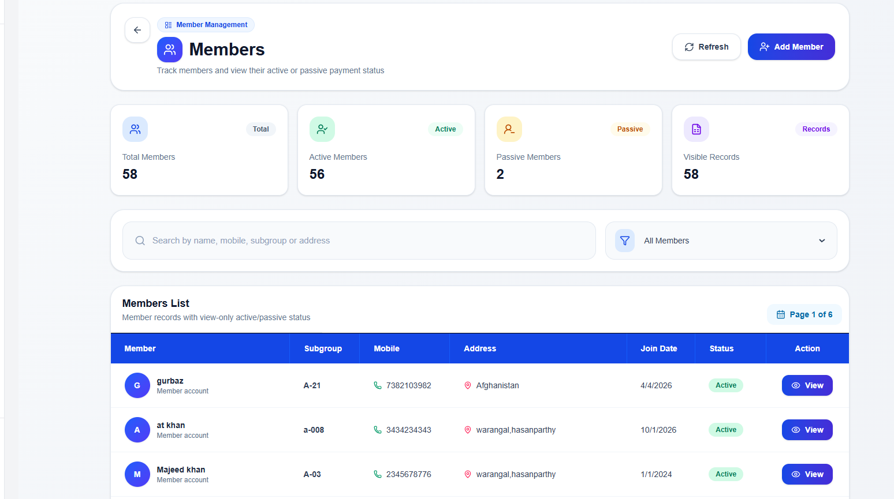
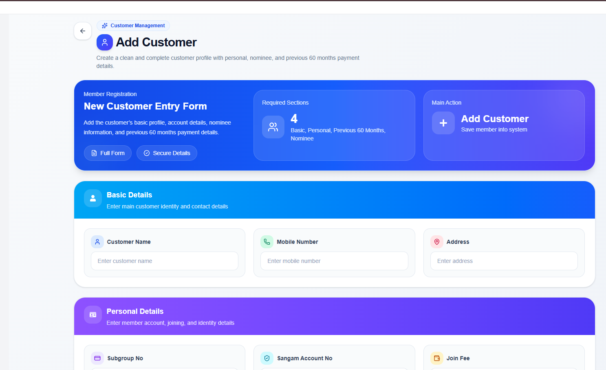
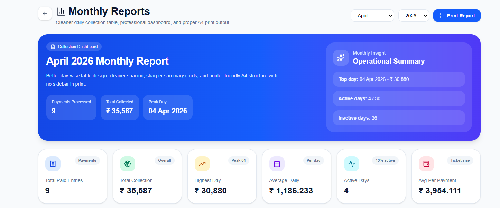

# LBFA Loan Software

LBFA Loan Software is a loan and member ledger management system built with separate frontend and backend applications.


A full-stack Loan & Member Ledger Management System designed to handle customer records, loan tracking, EMI schedules, and financial reports efficiently.

---

## 🌐 Live Demo

👉 **Frontend (Vercel):**  
https://lbfa-loan-software-k6ac.vercel.app  

👉 **Backend API:**  
https://lbfa-loan-software-1.onrender.com/api  

---

## 📸 Project Preview

### Dashboard





### member Management




### Reports



## Project Structure

```bash
lbfa_loan_software/
├── frontend_lbfa/
├── Loan_emi_Backend/
├── .gitignore
└── README.md
Tech Stack
Frontend
React
Axios
React Router
Tailwind CSS
Lucide React / React Icons

Backend
Node.js
Express.js
MongoDB
Mongoose
JWT Authentication
Features
Admin login
Customer management
Loan creation and tracking
EMI schedule handling
Member ledger management
Receipt and payment flow
Reports and dashboard

Local Setup
1. Clone the repository
git clone <your-repository-url>
cd lbfa_loan_software
2. Install frontend dependencies
cd frontend_lbfa
npm install
npm run dev
3. Install backend dependencies
cd Loan_emi_Backend
npm install
npm run dev
Environment Variables
Backend

Create a .env file inside Loan_emi_Backend and add:

PORT=5000
MONGO_URI=your_mongodb_connection_string
JWT_SECRET=your_jwt_secret
CLIENT_URL=http://localhost:5173
Frontend

Create a .env file inside frontend_lbfa and add:

VITE_API_URL=http://localhost:5000/api
Health Check

Backend health route:

GET /api/health
Notes
Do not commit .env files
Use .env.example files as templates
Keep secrets only in local environment files
Author

Mohammed Irfan


---

# Small correction in your README tree

Your current root folder name in local looks like:

```bash
lbfa_loan_software

So use that same name in the README for consistency.

What .env.example means in one line

Keep this simple in your mind:

.env = real values, private, local only
.env.example = sample format, safe to upload

Example:

real .env
JWT_SECRET=abc123supersecret
.env.example
JWT_SECRET=

Thats all